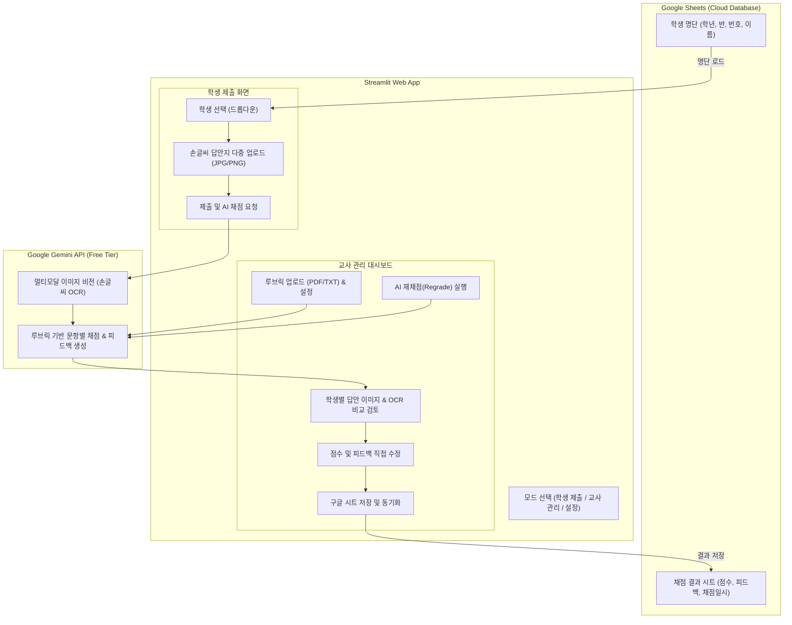

# 2. 시스템 및 기능 설계서 (Design)

*모든 설계 항목은 체크박스로 관리되며 실시간 진행 상황을 동기화합니다.*

---

## 1. 시스템 아키텍처 및 데이터 흐름

---

## 2. 세부 설계 체크리스트

### 1) 프로젝트 환경 및 보안 설계
- [x] **D-001**: Python 가상환경 및 의존성 라이브러리([`requirements.txt`](file:///c:/Users/USER/Desktop/IDE%20test01/requirements.txt)) 정의
- [x] **D-002**: Streamlit 환경 설정([`.streamlit/config.toml`](file:///c:/Users/USER/Desktop/IDE%20test01/.streamlit/config.toml), [`.streamlit/secrets.toml.template`](file:///c:/Users/USER/Desktop/IDE%20test01/.streamlit/secrets.toml.template)) 및 API 보안 가이드
- [x] **D-003**: Google Gemini API 키 및 Google Sheets Service Account 자격증명 연결 구조 설계

### 2) 데이터 핸들러 설계 ([`sheets_handler.py`](file:///c:/Users/USER/Desktop/IDE%20test01/sheets_handler.py))
- [x] **D-004**: Google Sheets API 클라이언트 초기화 및 인증 캐싱 (`@st.cache_resource`)
- [x] **D-005**: [명단 시트] 학년/반/번호/이름 목록 읽기 및 로컬 폴백(샘플 명단) 메커니즘
- [x] **D-006**: [결과 시트] 제출 이력 및 채점 데이터(학번, 이름, 문항별 점수, 총점, 피드백, 타임스탬프) 생성/수정/업서트(Upsert) 함수

### 3) AI 채점 및 OCR 엔진 설계 ([`gemini_evaluator.py`](file:///c:/Users/USER/Desktop/IDE%20test01/gemini_evaluator.py))
- [x] **D-007**: Google Generative AI (`google.generativeai`) 클라이언트 연동
- [x] **D-008**: 멀티모달 이미지(여러 장) 처리 및 PIL/바이트 변환 파이프라인
- [x] **D-009**: 루브릭 주입형 정형 JSON 출력 프롬프트 엔지니어링 (OCR 텍스트, 문항별 배점/득점, 감점 사유, 총평 피드백)
- [x] **D-010**: API 할당량(Rate Limit) 대응 예외 처리 및 재시도/Mock 로직

### 4) 유틸리티 설계 ([`utils.py`](file:///c:/Users/USER/Desktop/IDE%20test01/utils.py))
- [x] **D-011**: PDF 및 TXT 루브릭 텍스트 추출 함수 (`pypdf`)
- [x] **D-012**: 이미지 리사이징 및 압축 (Gemini 업로드 토큰 및 속도 최적화)
- [x] **D-013**: 채점 결과 포맷팅 및 한글 엑셀 CSV 다운로드 헬퍼

### 5) Streamlit UI/UX 인터페이스 설계 ([`app.py`](file:///c:/Users/USER/Desktop/IDE%20test01/app.py))
- [x] **D-014**: 페이지 설정 및 커스텀 CSS (세련된 카드 레이아웃, 모바일 반응형, 한글 폰트 지원)
- [x] **D-015**: **[탭 1: 학생 답안 제출]**
  - [x] 학년/반/번호/이름 드롭다운 캐스케이딩 선택
  - [x] 손글씨 답안지 다중 이미지 업로더 및 갤러리 프리뷰
  - [x] 제출 버튼 및 즉각적인 제출 확인/피드백 알림 UI
- [x] **D-016**: **[탭 2: 교사 채점 관리 & 대시보드]**
  - [x] 루브릭 업로드/입력 및 미리보기 카드
  - [x] 학생 제출 목록 현황판 (학급 인원/평균/최고점 요약 통계)
  - [x] 2단 분할 뷰: [좌] 원본 답안지 이미지 뷰어 vs [우] OCR 텍스트 & 문항별 점수/피드백 에디터
  - [x] "AI 재채점(Regrade)" 팝오버 및 사용자 정의 피드백 반영
  - [x] "구글 시트에 최종 저장" 버튼 및 상태 알림
- [x] **D-017**: **[탭 3: 시스템 연동 및 설정]**
  - [x] Gemini API 키 직접 입력/검증 인터페이스
  - [x] 구글 스프레드시트 URL 및 Service Account JSON 설정 가이드
